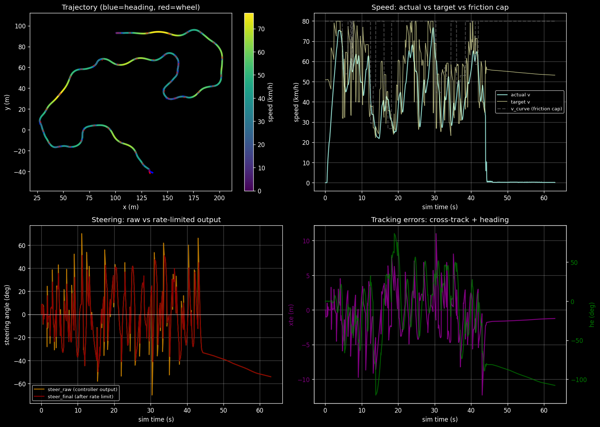
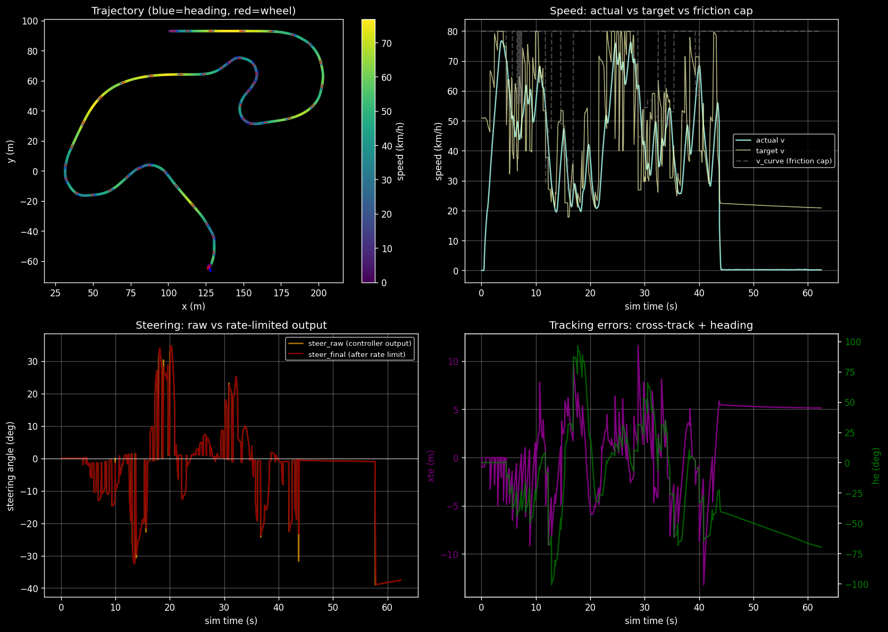
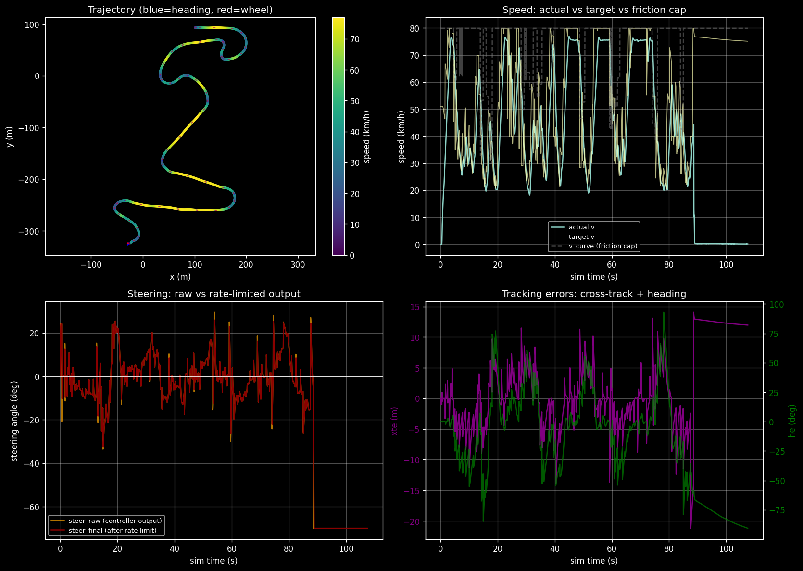
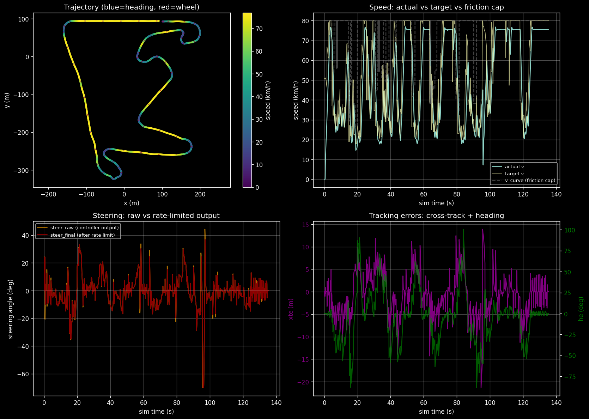
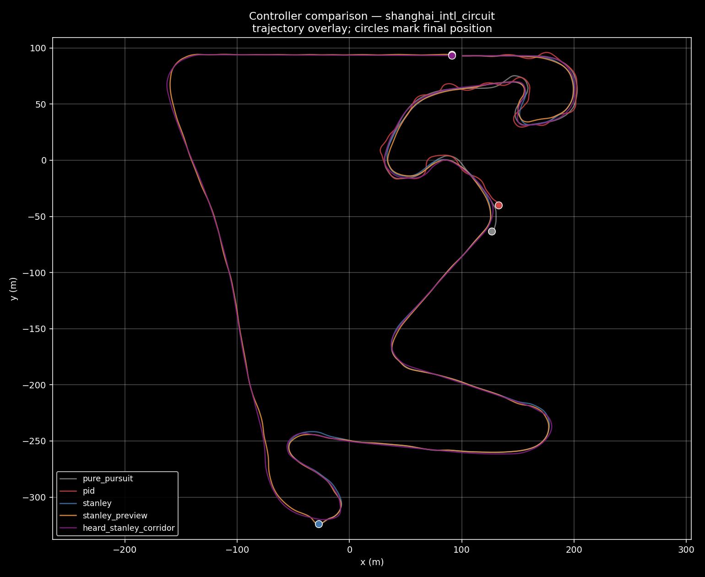
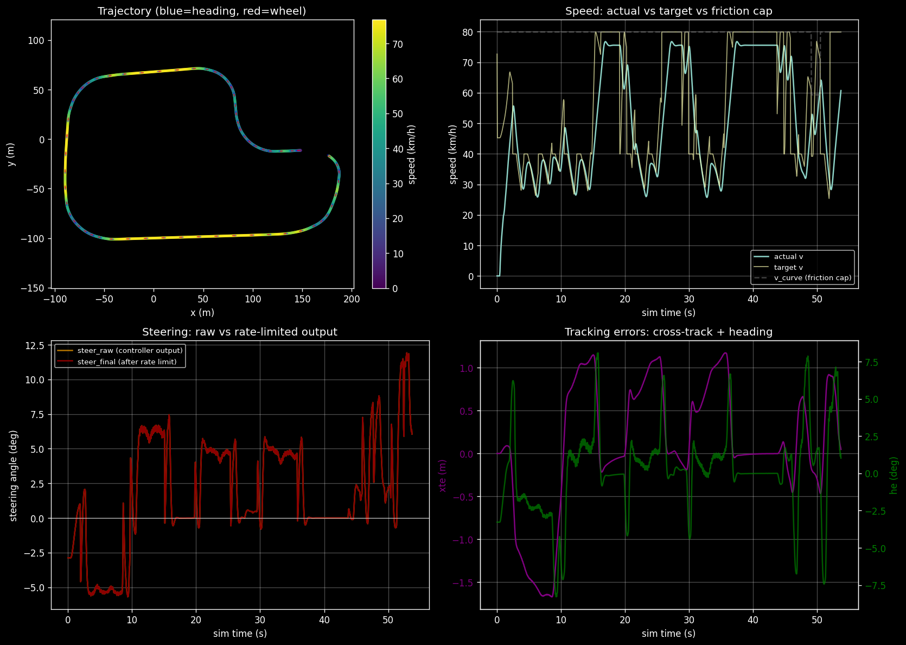
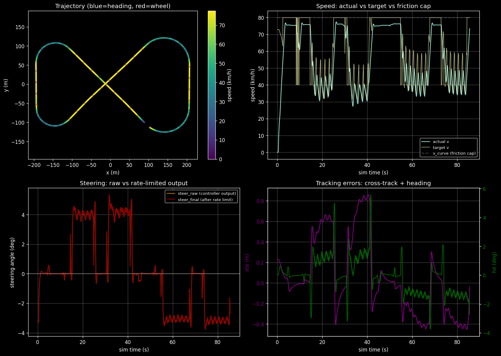
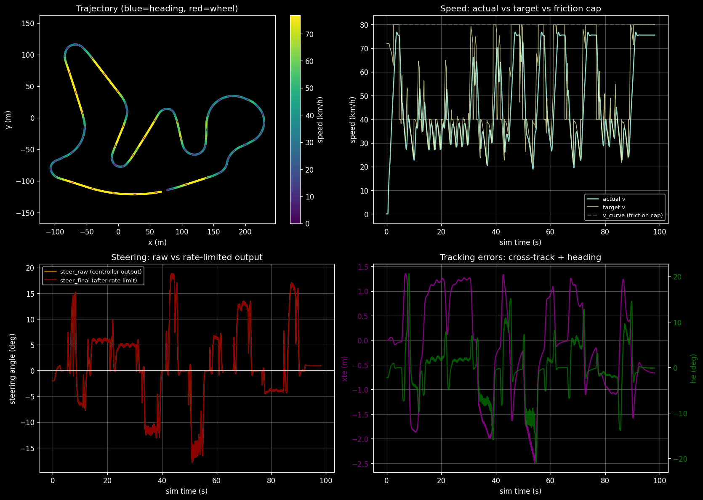
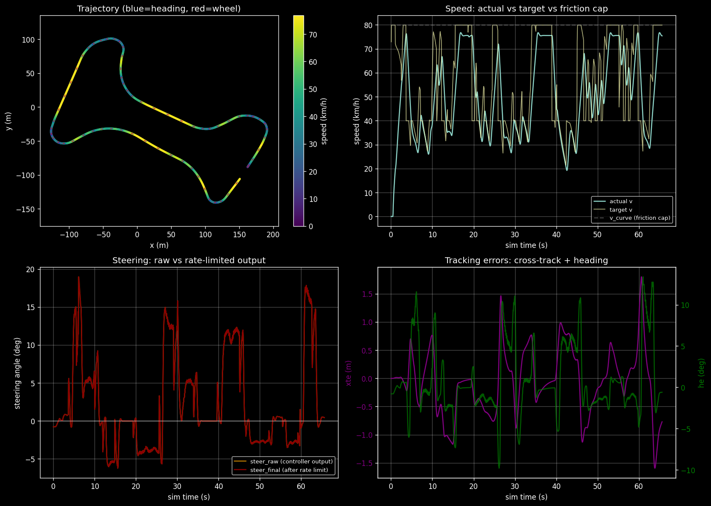
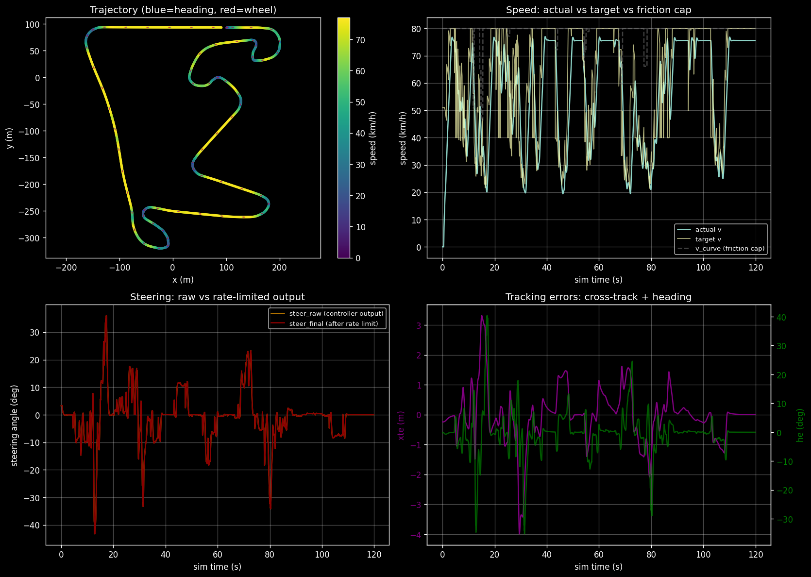

::: {.hero-section}

# GRAIC Controllers {.title}

::: {.subtitle}
Comparing our methods to create a better controller.
:::

::: {.author-list}

[**Weston Heard**](https://github.com/weston-heard)^1^

:::

::: {.affiliation-list}

^1^University of Illinois Urbana–Champaign · ECE 484, Spring 2026

:::

::: {.button-row}

[[ Code]{.btn-text}](https://github.com/weston-heard){.btn .btn-primary}

:::

:::


<!-- ============================================================ -->
<!-- HERO ASSET — my best controller video, no caption -->
<!-- ============================================================ -->

::: {.section-container}

::: {.hero-teaser}

<video autoplay loop muted playsinline preload="auto" class="teaser-img"><source src="static/videos/corridor.mp4" type="video/mp4"></video>

:::

:::


<!-- ============================================================ -->
<!-- HEADLINE NUMBERS -->
<!-- ============================================================ -->

::: {.section-container}

::: {.headline-grid}

::: {.headline-card}
### 5 / 5
Full laps completed on every GRAIC map.
:::

::: {.headline-card}
### −2.2 s
Faster than Yan's baseline on Shanghai.
:::

::: {.headline-card}
### 0
Collisions across the five benchmark laps.
:::

::: {.headline-card}
### 80 km/h
Top speed, 22.2 m/s.
:::

:::

:::


<!-- ============================================================ -->
<!-- INTRO -->
<!-- ============================================================ -->

::: {.section-container}

## The problem {.section-title #problem}

::: {.content-text}
GRAIC is a driving simulator built on CARLA. Normally the goal is full self-driving from cameras; for this project I was instead asked to build the *controller*, the loop that turns "where the path is" into "how much to steer." Four standard controllers from the course material, then a fifth I built after seeing what they all got wrong.
:::

:::


<!-- ============================================================ -->
<!-- SYSTEM OVERVIEW -->
<!-- ============================================================ -->

::: {.section-container}

## How it works {.section-title #system}

::: {.pipeline-grid}

::: {.pipeline-step}
**1 · CARLA gives state**

Position, heading, speed, and the upcoming waypoints + lane boundaries.
:::

::: {.pipeline-step}
**2 · agent.py computes commands**

My code picks a target speed and steering angle every tick.
:::

::: {.pipeline-step}
**3 · CARLA applies them**

The simulator drives the car with the throttle, brake, and steering I asked for.
:::

:::

:::


<!-- ============================================================ -->
<!-- MILESTONES -->
<!-- ============================================================ -->

::: {.section-container}

## Milestones {.section-title #milestones}

::: {.milestone-list}
- **M1.** Get the car moving.
- **M2.** Pull CARLA's vehicle parameters into the controller and finish at least one track.
- **M3.** Finish every track, and finish them faster.
:::

:::


<!-- ============================================================ -->
<!-- 1. PID -->
<!-- ============================================================ -->

::: {.section-container}

## 1 · PID {.section-title #pid}

::: {.content-text}
PID is the first controller anyone learns: look at how far off the path you are, multiply by gains, steer. The three knobs are P (the error right now), I (error piling up over time), and D (how fast the error is changing).

The catch: PID has no preview. By the time it reacts, the next sample has already flipped to the other side. The steering reverses, amplifies, and saturates. PID gets within one waypoint of finishing on the easiest map and fails much sooner on the rest.
:::

::: {.step-list}
**How it works, step by step**

1. Each tick, find the closest point on the path to the car.
2. Measure how far off the path the car is (cross-track error) and which way the car is pointing relative to the path (heading error).
3. Estimate how fast the cross-track error is changing.
4. Multiply each of those three values by its own gain and add them up.
5. Clamp the result to the steering limit and send it to the car.
:::

$$
\delta = k_{\psi}\, \psi_e \;-\; k_e\, e_{\text{xte}} \;-\; k_d\, \dot{e}_{\text{xte}}
$$

```python
def pid_step(state, path, gains):
    e_xte, psi_e = closest_point_errors(path, state.pos, state.heading)
    de_xte       = (e_xte - prev_e_xte) / dt
    delta = gains.k_psi * psi_e - gains.k_e * e_xte - gains.k_d * de_xte
    return clamp(delta, -delta_max, +delta_max)
```

<div class="viz-pair">
<div class="viz-card">
<video autoplay loop muted playsinline preload="auto"><source src="static/videos/pid.mp4" type="video/mp4"></video>
<div class="viz-caption"><strong>PID on Shanghai</strong> · the steering oscillates and pins to the stop on the first bend.</div>
</div>
<div class="viz-card">

<div class="viz-caption"><strong>Trace</strong> · stuck after 53 of 151 waypoints on Shanghai. One waypoint short of a lap on t1.</div>
</div>
</div>

:::


<!-- ============================================================ -->
<!-- 2. PURE PURSUIT -->
<!-- ============================================================ -->

::: {.section-container}

## 2 · Pure Pursuit {.section-title #pp}

::: {.content-text}
Pure Pursuit is the first controller that looks *ahead*. Pick a point a fixed distance in front of the car (the **lookahead point**), draw an arc from the car to that point, steer along the arc. Same thing a real driver does looking down the road.

The lookahead distance is a trade-off you cannot win: **too short** and the car oscillates; **too long** and the arc cuts straight across the inside of every corner (the *apex*), into the curb. Laps t1, fails everything else.
:::

::: {.step-list}
**How it works, step by step**

1. Pick a point on the path that is $L_d$ meters ahead of the car.
2. Measure the angle $\alpha$ between where the car is pointing and the line from the car to that point.
3. Compute the arc that starts at the car, faces the same direction as the car, and ends at the lookahead point.
4. Steer along that arc, clamped to the steering limit.
:::

$$
\delta = \arctan\!\left(\frac{2 L \sin\alpha}{L_d}\right)
$$

```python
def pure_pursuit_step(state, path, L, Ld):
    target  = path.point_ahead_of(state.pos, distance=Ld)
    alpha   = angle_between(state.heading, target - state.pos)
    delta   = atan2(2 * L * sin(alpha), Ld)
    return clamp(delta, -delta_max, +delta_max)
```

<div class="viz-pair">
<div class="viz-card">
<video autoplay loop muted playsinline preload="auto"><source src="static/videos/pure-pursuit.mp4" type="video/mp4"></video>
<div class="viz-caption"><strong>Pure Pursuit on Shanghai</strong> · the car cuts the inside of tight bends and stops on the curb.</div>
</div>
<div class="viz-card">

<div class="viz-caption"><strong>Trace</strong> · laps t1 in 54.8 s; stuck on every harder map. The lookahead-vs-apex trade-off is geometric, not a tuning issue.</div>
</div>
</div>

:::


<!-- ============================================================ -->
<!-- 3. STANLEY -->
<!-- ============================================================ -->

::: {.section-container}

## 3 · Stanley {.section-title #stanley}

::: {.content-text}
Stanley is the cleanest of the four. It uses two pieces: a heading correction (match the path's direction) and a sideways correction wrapped in `arctan` so it stays gentle at high speed.

It gets the furthest of any standard controller, two-thirds of the way around Shanghai, but the 5 m waypoint spacing makes the path jagged, and Stanley reacts to every jag. The lateral law is right; the path it is chasing is too rough.
:::

::: {.step-list}
**How it works, step by step**

1. Find the closest point on the path to the *front axle* of the car.
2. Measure heading error: the angle between the path's direction at that point and the car's direction.
3. Measure how far sideways the car is from the path (cross-track error).
4. Add the heading error to `arctan(k · cross_track / (v + ε))`. The `arctan` bounds the sideways term; the `v` makes the correction softer at high speed.
5. Clamp to the steering limit.
:::

$$
\delta = \psi_e + \arctan\!\left(\frac{k\, e_y}{v + \varepsilon}\right)
$$

::: {.content-text style="font-size:0.92rem;color:var(--text-muted);"}
*Symbols:* $\psi_e$ is heading error. $e_y$ is sideways (cross-track) error. $v$ is the car's speed. $\varepsilon$ ("epsilon") is a tiny positive constant in the denominator that prevents dividing by zero when the car is stopped (v = 0).
:::

```python
def stanley_step(state, path, k, v_eps):
    e_y    = signed_cross_track_error(path, state.front_axle)
    psi_e  = wrap(path.tangent_at(state.front_axle) - state.heading)
    delta  = psi_e + atan2(k * e_y, state.v + v_eps)
    return clamp(delta, -delta_max, +delta_max)
```

<div class="viz-pair">
<div class="viz-card">
<video autoplay loop muted playsinline preload="auto"><source src="static/videos/stanley.mp4" type="video/mp4"></video>
<div class="viz-caption"><strong>Stanley on Shanghai</strong> · smooth in straights, wobbles in broad turns where the waypoints are jagged.</div>
</div>
<div class="viz-card">

<div class="viz-caption"><strong>Trace</strong> · reaches 102 of 151 on Shanghai, 37/38 on t1, fails sooner on t2/t3/t4. The lateral law is right; the reference path is too jagged.</div>
</div>
</div>

:::


<!-- ============================================================ -->
<!-- 4. STANLEY + PREVIEW -->
<!-- ============================================================ -->

::: {.section-container}

## 4 · Stanley + Preview {.section-title #preview}

::: {.content-text}
If Stanley only reacts after the error has built up, the fix is to give it preview. I added a feedforward term proportional to how much the path bends a short distance ahead. The road curves, the steering curves with it.

This is the first controller in the lineup that **laps Shanghai** (135.4 s). Preview didn't fix the tighter maps, but finishing matters more than shaving seconds.
:::

::: {.step-list}
**How it works, step by step**

1. Run Stanley exactly as above to get a base steering value.
2. Look at the path a preview distance ahead and measure its curvature there.
3. Add a feedforward term `k_ff · curvature_preview` to the steering value.
4. Clamp to the steering limit.
:::

$$
\delta = \psi_e + \arctan\!\left(\frac{k\, e_y}{v + \varepsilon}\right) + k_{ff}\,\kappa_{\text{preview}}
$$

::: {.content-text style="font-size:0.92rem;color:var(--text-muted);"}
*New symbol:* $\kappa$ ("kappa") is the path's curvature — a measure of how tightly the road is bending right at that point. Roughly, $\kappa = 1 / \text{radius}$. A straight road has $\kappa \approx 0$; a hairpin has high $\kappa$. $\kappa_{\text{preview}}$ is the curvature read a short distance ahead of the car, not at the car's current position.
:::

```python
def stanley_preview_step(state, path, k, k_ff, v_eps):
    e_y       = signed_cross_track_error(path, state.front_axle)
    psi_e     = wrap(path.tangent_at(state.front_axle) - state.heading)
    kappa_pv  = path.curvature_at(state.pos, preview=preview_dist(state.v))
    delta     = psi_e + atan2(k * e_y, state.v + v_eps) + k_ff * kappa_pv
    return clamp(delta, -delta_max, +delta_max)
```

<div class="viz-pair">
<div class="viz-card">
<video autoplay loop muted playsinline preload="auto"><source src="static/videos/stanley-preview.mp4" type="video/mp4"></video>
<div class="viz-caption"><strong>Stanley + Preview on Shanghai</strong> · the car anticipates the bends and finishes the lap.</div>
</div>
<div class="viz-card">

<div class="viz-caption"><strong>Trace</strong> · LAP on Shanghai in 135.4 s. First controller in the lineup to finish a hard map.</div>
</div>
</div>

:::


<!-- ============================================================ -->
<!-- 5. MY CUSTOM CONTROLLER -->
<!-- ============================================================ -->

::: {.section-container}

## 5 · My custom controller (heard_stanley) {.section-title #mine}

::: {.content-text}
The four standard controllers all did two things wrong: they followed the raw 5 m waypoint list (jagged), and they drove through the middle of every corner. A real driver smooths the line and clips the inside.

Two changes. First, instead of following the waypoints, I build a *corridor* from the lane boundaries each tick and follow its **smooth midline**. The jagged-path problem disappears. Second, in any corner above a curvature threshold, the controller shifts its sideways target toward the inside, capped at 2 m. The Stanley law underneath is unchanged; only the target moved.

Result: laps all 5 maps. Shanghai in **119.8 s**, **2.2 s faster than Yan's baseline**.
:::

::: {.step-list}
**How it works, step by step**

1. Each tick, build a corridor from the lane boundaries returned by CARLA.
2. Sample the corridor's midline every 1 m to get a smooth, dense reference path.
3. Compute Stanley errors against the midline.
4. Look up how tight the path is curving at the car's location.
5. If the path is bending hard enough, shift the sideways target toward the inside of the corner (proportional to the curvature, capped at ±2 m).
6. Run Stanley with the shifted target, clamp.
:::

$$
e_y^{\text{set}} = \mathrm{clip}\!\left(g \cdot \kappa,\; \pm e_{\max}\right),
\qquad \delta = \psi_e + \arctan\!\left(\frac{k\,(e_y - e_y^{\text{set}})}{v + \varepsilon}\right)
$$

```python
def heard_stanley_step(state, corridor, k, g, e_max, v_eps):
    midline = corridor.sample_midline(spacing=1.0)
    e_y     = signed_cross_track_error(midline, state.front_axle)
    psi_e   = wrap(midline.tangent_at(state.front_axle) - state.heading)
    kappa   = midline.curvature_at(state.front_axle)

    # shift the target toward the inside of the corner, capped so the car
    # never gets within 2 m of the inside curb.
    e_y_set = clip(g * kappa, -e_max, +e_max)

    delta   = psi_e + atan2(k * (e_y - e_y_set), state.v + v_eps)
    return clamp(delta, -delta_max, +delta_max)
```

::: {.content-text}
**The speed plan.** Hard-capped at 22.2 m/s (80 km/h). Each path point gets a curvature-limited safe speed `v_curve = √(a_lat_max / κ)` using a 4 m/s² lateral budget (a real Tesla can do twice that, but I kept it conservative to stay off the curbs). A backward sweep makes sure the car can brake to those limits in time. Zero collisions across all five maps.
:::

<div class="viz-pair">
<div class="viz-card">
<video autoplay loop muted playsinline preload="auto"><source src="static/videos/corridor.mp4" type="video/mp4"></video>
<div class="viz-caption"><strong>heard_stanley on Shanghai</strong> · smooth through the sweepers, clips the inside of the late-track corners.</div>
</div>
<div class="viz-card">

<div class="viz-caption"><strong>Trace</strong> · 119.8 s, LAP 151/151. 2.2 s faster than Yan's baseline.</div>
</div>
</div>

:::


<!-- ============================================================ -->
<!-- ALL FIVE SIDE BY SIDE -->
<!-- ============================================================ -->

::: {.section-container}

## Same map, different results {.section-title #side-by-side}

{.teaser-img style="display:block;margin:0 auto 1.5rem;max-width:920px;border-radius:14px;border:1px solid var(--glass-border);box-shadow:0 0 0 1px rgba(0,240,255,0.10) inset,0 10px 40px rgba(0,0,0,0.6),0 0 60px rgba(0,240,255,0.15);"}

<div class="gif-stack-32">
<div class="row-3">
<div class="gif-cell">
<video autoplay loop muted playsinline preload="auto"><source src="static/videos/pid.mp4" type="video/mp4"></video>
<div class="label">PID · stuck</div>
</div>
<div class="gif-cell">
<video autoplay loop muted playsinline preload="auto"><source src="static/videos/pure-pursuit.mp4" type="video/mp4"></video>
<div class="label">Pure Pursuit · stuck</div>
</div>
<div class="gif-cell">
<video autoplay loop muted playsinline preload="auto"><source src="static/videos/stanley.mp4" type="video/mp4"></video>
<div class="label">Stanley · stuck</div>
</div>
</div>
<div class="row-2">
<div class="gif-cell">
<video autoplay loop muted playsinline preload="auto"><source src="static/videos/stanley-preview.mp4" type="video/mp4"></video>
<div class="label">Stanley + Preview · 135.4 s</div>
</div>
<div class="gif-cell">
<video autoplay loop muted playsinline preload="auto"><source src="static/videos/corridor.mp4" type="video/mp4"></video>
<div class="label">heard_stanley (mine) · 119.8 s</div>
</div>
</div>
</div>

:::


<!-- ============================================================ -->
<!-- SHOWDOWN TABLE — ALL CONTROLLERS × ALL MAPS -->
<!-- ============================================================ -->

::: {.section-container}

## How they stack up on every map {.section-title #showdown}

| Controller | t1_triple (38 wp) | t2_triple (66 wp) | t3 (64 wp) | t4 (46 wp) | shanghai (151 wp) |
|---|:---:|:---:|:---:|:---:|:---:|
| Pure Pursuit | LAP 54.8 s | stuck 8 / 66 | stuck 6 / 64 | stuck 4 / 46 | stuck 54 / 151 |
| PID | stuck 37 / 38 | stuck 8 / 66 | stuck 20 / 64 | stuck 28 / 46 | stuck 53 / 151 |
| Stanley | stuck 37 / 38 | stuck 8 / 66 | stuck 19 / 64 | stuck 3 / 46 | stuck 102 / 151 |
| Stanley + Preview | stuck 37 / 38 | stuck 8 / 66 | stuck 19 / 64 | stuck 3 / 46 | **LAP 135.4 s** |
| **heard_stanley (mine)** | **LAP 53.7 s** | **LAP 85.5 s** | **LAP 98.1 s** | **LAP 65.6 s** | **LAP 119.8 s** |

:::


<!-- ============================================================ -->
<!-- LESSONS LEARNED -->
<!-- ============================================================ -->

::: {.section-container}

## What I learned {.section-title #lessons}

::: {.content-text}
The custom controller arrived in steps, each one fixing what the last one broke.
:::

::: {.step-list}
1. Standard controllers drove through the middle of every corner. So I made mine hug the inside.
2. Hugging worked in corners but also on straightaways, where there is no inside. The car drifted toward the curb.
3. So I made the hug scale with how tight the turn is. Straight road, no shift. Tight corner, big shift.
4. That clipped the inside curb on the tightest bends.
5. Capped the shift at 2 m. Racing line on broad sweepers, no curb on tight ones.
:::

::: {.content-text}
Take-away: it was not the control law that needed changing. It was what the controller was *aiming at*.
:::

:::


<!-- ============================================================ -->
<!-- MINE ON EVERY MAP (PER-MAP ROWS — NO TALKING POINTS) -->
<!-- ============================================================ -->

::: {.section-container}

## My controller on every map {.section-title #every-map}

::: {.content-text}
With how my controller performed on Shanghai, here is how it did on the other tracks.
:::

:::


::: {.per-map-row}

### t1_triple · 53.7 s · LAP 38 / 38



::: {.yan-line}
Mine <span class="my">53.7 s</span> · Yan baseline <span class="yan">45.0 s</span> · Δ <span class="delta-bad">+8.7 s</span>
:::

:::


::: {.per-map-row}

### t2_triple · 85.5 s · LAP 66 / 66



::: {.yan-line}
Mine <span class="my">85.5 s</span> · Yan baseline <span class="yan">74.0 s</span> · Δ <span class="delta-bad">+11.5 s</span>
:::

:::


::: {.per-map-row}

### t3 · 98.1 s · LAP 64 / 64



::: {.yan-line}
Mine <span class="my">98.1 s</span> · Yan baseline <span class="yan">82.0 s</span> · Δ <span class="delta-bad">+16.1 s</span>
:::

:::


::: {.per-map-row}

### t4 · 65.6 s · LAP 46 / 46



::: {.yan-line}
Mine <span class="my">65.6 s</span> · Yan baseline <span class="yan">57.0 s</span> · Δ <span class="delta-bad">+8.6 s</span>
:::

:::


::: {.per-map-row}

### shanghai · 119.8 s · LAP 151 / 151



::: {.yan-line}
Mine <span class="my">119.8 s</span> · Yan baseline <span class="yan">122.0 s</span> · Δ <span class="delta-good">−2.2 s</span>
:::

:::


<!-- ============================================================ -->
<!-- ENDING: THANKS + QUESTIONS -->
<!-- ============================================================ -->

::: {.section-container}

## Thanks {.section-title #thanks}

::: {.thanks-block}
Thank you to the ECE 484 course staff for accommodating me on this project, and leading one of the most fun and interactive classes I have ever taken. Thank you!
:::

::: {.questions-end}
Questions?
:::

:::


::: {.site-footer}

ECE 484, Spring 2026 · University of Illinois Urbana–Champaign ·
[GitHub repository](https://github.com/weston-heard)

:::

::: {.references-footnote}

**References.** The control laws used here come from ECE 484 lecture material (PID, Pure Pursuit, Stanley, friction-circle planning) and the course Machine Problems (MP1 introduced Pure Pursuit; MP2 / MP3 contributed scaffolding for the longitudinal planner). The CARLA simulator and the PoPGRI Race scaffolding (course staff) provided the simulation environment and baseline `agent.py`. The reference controller to beat was written by Yan Miao.

:::
